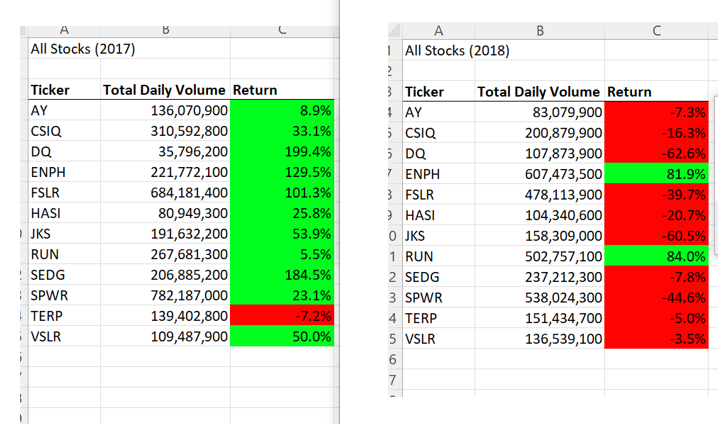

# VBA of Wall Street Stock Analysis

## Overview of Project

A friend named Steve has for an Excel tool so that he can better analyze stocks. He is advising his parents on one particular green stock they are interested in (DAQO). Ultimately, Steve would like the ability to analyze the entire stock market over the last few years. 

### Purpose

The purpose of this project is to develop an efficient tool in Excel to analyze multiple stocks over several years. The best way to do that was to code a program using Microsoft Visual Basic for Applications (VBA). First, the stock of interest (ticker DQ) was isolated and examined using total daily stock volume and its yearly return. The return was based on the starting price and ending price over the course of one year.  This method was expanded to run the analysis of twelve different stocks. The analyzation tool was taken a step further when it was refactored to reduce processing time. 

## Results
There is a big difference in the stock performances between 2017 and 2018. Only one of the twelve analyzed stocks had a negative yearly return in 2017. In 2018, the performances are essentially flipped, with only two of the stocks having a positive yearly return. This demonstates that the return on stocks can vary greatly from year to year. See image below:



### The original code analyzing twelve stocks:
```
Sub AllStocksAnalysis()
    '1) Format the output sheet on the "All Stocks Analysis" worksheet.
    
    Worksheets("All Stocks Analysis").Activate
    
    Dim startTime As Single
    Dim endTime As Single
    
    yearValue = InputBox("What year would you like to run the analysis on?")
    
    startTime = Timer
    
    Range("A1").Value = "All Stocks (" + yearValue + ")"
    
    'Create a header row
    Cells(3, 1).Value = "Ticker"
    Cells(3, 2).Value = "Total Daily Volume"
    Cells(3, 3).Value = "Return"
      
    '2) Initialize an array of all tickers
    
    Dim tickers(11) As String
    
    tickers(0) = "AY"
    tickers(1) = "CSIQ"
    tickers(2) = "DQ"
    tickers(3) = "ENPH"
    tickers(4) = "FSLR"
    tickers(5) = "HASI"
    tickers(6) = "JKS"
    tickers(7) = "RUN"
    tickers(8) = "SEDG"
    tickers(9) = "SPWR"
    tickers(10) = "TERP"
    tickers(11) = "VSLR"
      
    '3a) Initialize variables for the starting price and ending price
    
    Dim startingPrice As Double
    Dim endingPrice As Double
    
    '3b) Activate the data worksheet
    
    Sheets(yearValue).Activate
    
    '3c) Find the number of rows to loop over.
    
    RowCount = Cells(Rows.Count, "A").End(xlUp).Row
    
    '4) Loop through the tickers.
    
     For i = 0 To 11
    
    ticker = tickers(i)
    totalVolume = 0
    
    '5) Loop through rows in the data
   
    Sheets(yearValue).Activate
    For j = 2 To RowCount
    
    '5a) Find volume for the current ticker
    
    If Cells(j, 1).Value = ticker Then
        
        totalVolume = totalVolume + Cells(j, 8).Value
        
        End If
        
    '5b) Find the starting price for the current ticker.
        
        If Cells(j - 1, 1).Value <> ticker And Cells(j, 1).Value = ticker Then
        startingPrice = Cells(j, 6).Value
        
        End If
        
    '5c) Find the ending price for the current ticker
        
        If Cells(j + 1, 1).Value <> ticker And Cells(j, 1).Value = ticker Then
        endingPrice = Cells(j, 6).Value
        
        End If
    
    Next j
    
    '6) Output the data for the current ticker
    
        Worksheets("All Stocks Analysis").Activate
        
   
    Cells(4 + i, 1).Value = ticker
    Cells(4 + i, 2).Value = totalVolume
    Cells(4 + i, 3).Value = endingPrice / startingPrice - 1
    
    
    Next i
    
    endTime = Timer
    
    MsgBox "This code ran in " & (endTime - startTime) & " seconds for the year " & (yearValue)
    
   
End Sub
```


### The refactored code analyzing the same twelve stocks:
```
Sub AllStocksAnalysisRefactored()

    Dim startTime As Single
    Dim endTime  As Single

    yearValue = InputBox("What year would you like to run the analysis on?")

    startTime = Timer
    
    'Format the output sheet on All Stocks Analysis worksheet
    Worksheets("All Stocks Analysis").Activate
    
    Range("A1").Value = "All Stocks (" + yearValue + ")"
    
    'Create a header row
    Cells(3, 1).Value = "Ticker"
    Cells(3, 2).Value = "Total Daily Volume"
    Cells(3, 3).Value = "Return"

    'Initialize array of all tickers
    Dim tickers(12) As String
    
    tickers(0) = "AY"
    tickers(1) = "CSIQ"
    tickers(2) = "DQ"
    tickers(3) = "ENPH"
    tickers(4) = "FSLR"
    tickers(5) = "HASI"
    tickers(6) = "JKS"
    tickers(7) = "RUN"
    tickers(8) = "SEDG"
    tickers(9) = "SPWR"
    tickers(10) = "TERP"
    tickers(11) = "VSLR"
    
    'Activate data worksheet
    Worksheets(yearValue).Activate
    
    'Get the number of rows to loop over
    RowCount = Cells(Rows.Count, "A").End(xlUp).Row
    
    '1a) Create a ticker Index
    
    Dim tickerIndex As Single
    
    tickerIndex = 0
    
    

    '1b) Create three output arrays
    
    Dim tickerVolumes(12) As Long
    Dim tickerStartingPrices(12) As Single
    Dim tickerEndingPrices(12) As Single
    

    
    '2a) Create a for loop to initialize the tickerVolumes to zero.
    
    For i = 0 To 11
    
    tickerVolumes(i) = 0
    
    Next i
    
    
        
    '2b) Loop over all the rows in the spreadsheet.
        For i = 2 To RowCount
    
    
    
    '3a) Increase volume for current ticker
        
        
        tickerVolumes(tickerIndex) = tickerVolumes(tickerIndex) + Cells(i, 8).Value
            
        
        
        '3b) Check if the current row is the first row with the selected tickerIndex.
        
            
            If Cells(i, 1).Value = tickers(tickerIndex) And Cells(i - 1, 1).Value <> tickers(tickerIndex) Then

            
            tickerStartingPrices(tickerIndex) = Cells(i, 6).Value
                
        
            End If
        
        '3c) check if the current row is the last row with the selected ticker
        
        'If the next row ticker does not match, increase the tickerIndex
            
            If Cells(i, 1).Value = tickers(tickerIndex) And Cells(i + 1, 1).Value <> tickers(tickerIndex) Then
            
            
            tickerEndingPrices(tickerIndex) = Cells(i, 6).Value
            
            
        
        '3d Increase the tickerIndex.
        
        
            tickerIndex = tickerIndex + 1
            
            
        End If
    
    Next i
    
    '4) Loop through your arrays to output the Ticker, Total Daily Volume, and Return.
    
    For i = 0 To 11
        
        Worksheets("All Stocks Analysis").Activate
        
        tickerIndex = i
        
        
        Cells(4 + i, 1).Value = tickers(tickerIndex)
        Cells(4 + i, 2).Value = tickerVolumes(tickerIndex)
        Cells(4 + i, 3).Value = tickerEndingPrices(tickerIndex) / tickerStartingPrices(tickerIndex) - 1
        
        
    Next i
    
    'Formatting
    Worksheets("All Stocks Analysis").Activate
    Range("A3:C3").Font.FontStyle = "Bold"
    Range("A3:C3").Borders(xlEdgeBottom).LineStyle = xlContinuous
    Range("B4:B15").NumberFormat = "#,##0"
    Range("C4:C15").NumberFormat = "0.0%"
    Columns("B").AutoFit

    dataRowStart = 4
    dataRowEnd = 15

    For i = dataRowStart To dataRowEnd
        
        If Cells(i, 3) > 0 Then
            
            Cells(i, 3).Interior.Color = vbGreen
            
        Else
        
            Cells(i, 3).Interior.Color = vbRed
            
        End If
        
    Next i
 
    endTime = Timer
    MsgBox "This code ran in " & (endTime - startTime) & " seconds for the year " & (yearValue)

End Sub
```


### The original code execution times for 2017 and 2018:


### The refactored code execution times for the same years:


The refactored code runs 83% faster than the original code. The refacored code is more efficient while achieving the same output. 

## Summary

### What are the advantages or disadvantages of refactoring code?

According to the book *Refactoring, Improving the Design of Existing Code* by Martin Fowler, the advantages of refactoring code are:
* improves the design of software
* makes software easier to understand
* helps finding bugs
* helps programming run faster

Depending on the size of the program, refactoring can be a time consuming process with no guarantee of the desired outcomes. In addition, if previous or subsequent refers to and element in the code, refactoring can start and undesired a domino effect. 

### How do these pros and cons apply to refactoring the original VBA script?

By utilizing different modules when refactoring in VBA script, the original and refactored code can be compared side by side. The outcomes and execution times can also be compared directly. Because the stock analysis code was not lengthly and was a singular project, excess time usage was not an issue nor was the affecting previous or subsequent projects. 


